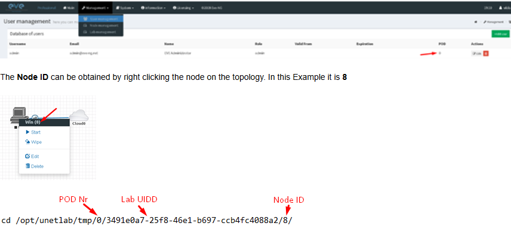

## 🚀 Guia: Criando Imagens Windows no EVE-NG (QEMU)
Este processo é dividido em três fases críticas: Preparação, Instalação e Selagem (Sysprep).

## 📥 Downloads Oficiais

* [ISO Windows Server 2019](https://www.microsoft.com/pt-br/evalcenter/evaluate-windows-server-2019)
* [Drivers VirtIO](https://github.com/virtio-win/virtio-win-pkg-scripts)
* [Windows 11](https://www.microsoft.com/pt-br/software-download/windows11)

**Drivers VirtIO (Essencial): O EVE-NG precisa desses drivers para que o Windows reconheça o disco rígido virtual. Baixe a ISO estável aqui: VirtIO Win ISO.**

### 2. Preparação do Diretório no EVE-NG
Acesse o seu EVE-NG via SSH (usando o PuTTY ou o terminal) e crie a pasta para a imagem. O nome da pasta deve seguir o padrão do EVE-NG:

 ```bash
#Para Windows Server 2019
mkdir -p /opt/unetlab/addons/qemu/winserver-2019-custom/

#Para Windows 11
mkdir -p /opt/unetlab/addons/qemu/win11-custom/

Suba a sua ISO do Windows para dentro dessa pasta usando o WinSCP e renomeie-a obrigatoriamente para cdrom.iso.
```

## 3. Criação do Disco Rígido Virtual
Dentro da pasta criada, execute o comando para criar o HD virtual.
```bash
#Server 2019:  Recomendado 60GB.

  /opt/qemu/bin/qemu-img create -f qcow2 virtioa.qcow2 60G

#Windows 11: Recomendado 20GB.

  /opt/qemu/bin/qemu-img create -f qcow2 virtioa.qcow2 20G

```

## 4. Instalação e Drivers VirtIO<br>
Ao adicionar o nó no EVE-NG, certifique-se de montar a ISO do VirtIO no segundo slot de CD-ROM.

Inicie a máquina. No momento de escolher o disco, ele aparecerá vazio.

Clique em "Carregar Driver" e navegue até a unidade de CD do VirtIO (Geralmente é o driver B).

Escolha a pasta correspondente à versão do Windows (ex: vioscsi\2k19\amd64).

Após o driver carregar, o disco aparecerá e você poderá seguir com a instalação normal.

## 5. O Passo de Ouro: Sysprep (Antes do Commit)


O passo do Sysprep é obrigatório para evitar conflitos de SID em sua rede virtual.

Após instalar o Windows, configurar os usuários e instalar os softwares básicos, não desligue a máquina normalmente.<b> siga este passo:

  No Windows, pressione Win + R e digite sysprep.

  Abra a pasta e execute o aplicativo sysprep.exe.

  Configure exatamente assim:

  Ação de Limpeza do Sistema: Entrar na Configuração de Fora da Caixa (OOBE).

  Generalizar: Marque esta caixa (Isso limpa o SID único).

  Opções de Desligamento: Selecione Desligar.

Nota: O Windows irá processar a limpeza e desligar sozinho. Não ligue a máquina novamente no EVE-NG ainda!

## 6. Finalização e Commit<br>
Agora que a máquina desligou via Sysprep, precisamos salvar esse estado como a "imagem base" para que todos os novos nós criados usem esse disco limpo.

No terminal do EVE-NG, descubra o ID do seu laboratório e da pasta temporária da máquina e execute:



 
# Comando genérico para salvar as alterações no arquivo original<br>
```bash
/opt/qemu/bin/qemu-img commit /opt/unetlab/tmp/0/UUID_DO_LAB/1/virtioa.qcow2
```

# 💡 Dica Pro: Limpeza de Permissões<br>
Para garantir que o EVE-NG consiga ler o novo arquivo criado, rode sempre o comando de correção de permissões após terminar:

```bash
/opt/unetlab/wrappers/unl_wrapper -a fixpermissions
```
